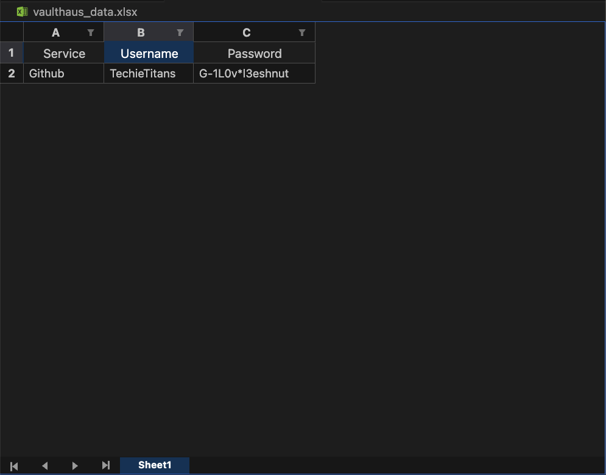

# 🏠 VaultHaus 

**VaultHaus** is a secure and minimal **CLI (Command-Line Interface)** password manager built with **Python**.  
It helps you generate, view, update, and delete passwords — all stored safely in an **Excel file** on your local machine.

---

## 🚀 Features

- 🔐 **View Vault:** See all your saved services, usernames, and passwords in a clean tabular format.  
- ⚙️ **Generate Strong Passwords:** Automatically create random, secure passwords with customizable length and character types.  
- 🧱 **Update Vault Items:** Modify any saved record or regenerate new passwords anytime.  
- 🗑️ **Delete Vault Items:** Remove outdated credentials with confirmation for safety.  
- 💾 **Auto Save:** All data is saved in `vaulthaus_data.xlsx` using **pandas**.  
- 🖥️ **User-Friendly CLI Interface:** Interactive menus and visual feedback for a smooth experience.  

---

## 💎 Unique Selling Proposition (USP)

Unlike other complex or cloud-based password managers, **VaultHaus** is **completely offline**, **lightweight**, and **transparent**.  
It gives you **full control** — no hidden APIs, no background sync, and no risk of online data leaks.  
VaultHaus is built for **developers and privacy-conscious users** who want simplicity, portability, and data ownership — all in one tool.

> 🧠 **Your vault. Your rules. Your password.**

---

## 📂 Project Structure
 ```
VaultHaus/
    │
    │
    ├── vaulthaus-cli/
    │          │
    │          ├── images
    │          │       │
    │          │       └── excel.png
    │          │
    │          ├── .gitattributes  
    │          │
    │          ├── .gitignore 
    │          │
    │          ├──  main.py
    │
    └── README.md 
      
```


---

## ⚙️ Requirements

Make sure you have **Python 3.8+** installed.

Install required dependencies using pip:

```bash
pip install pandas tabulate openpyxl
```
---
 
## ▶️ How to Run

Run the project directly from your terminal:

```bash
main.py
```

👀 You’ll see the main menu:

```bash
==========================================================================
                           Welcome to VaultHaus

                   Your vault. Your rules. Your password.
==========================================================================
(1) View Vault
(2) Generate a new vault item
(3) Update an existing vault item
(4) Delete an existing vault item
(5) Quit
--------------------------------------------------------------------------
```

## 💡 Password Generation Tips
 VaultHaus helps you create strong passwords with an ideal balance of characters. The table below shows the recommended counts, but you can customize how many of each type to include when generating a password.

 | No. | Character Type     | Ideal Proportion of Characters |
 |:---:|--------------------|:-----------------:|
 | 1   | Letters (a-z, A-Z) | 8–12              |
 | 2   | Numbers (0-9)      | 2–4               |
 | 3   | Symbols (!@#$%)    | 2–4               |

---

## 🎥 VaultHaus Demo

 
<video width="640" height="360" controls>
  <source src="VaultHaus/vid.mp4"type="video/mp4">
  Your browser does not support the video tag.
</video>

## 🧠 Example Usage

```bash
Which Service or Website is this for(e.g, Github , Google): 'Github'
What is your actual Username for Github :  'TechieTitans'
How many letters :  10
How many numbers :  3
How many symbols :  3

   Service: Github
   Username: TechieTitans

   Generating......
   Password: ,G-1L0v*l3eshnut

✅ Add new vault Sucessfully.
```
---
## 😎 View Vault:

```bash
--- 🔐 Your VaultHaus Items ---
+---+----------+---------------+------------------+
| # | Service  | Username      | Password         |
+---+----------+------------+---------------------+
| 1 | Github   | TechieTitans  | ,G-1L0v*l3eshnut |
+---+----------+---------------+------------------+
```
---
## 👀 Vault Data in Excel


---
## 🧩 Tech Stack

- Python 3

- pandas → Excel data management

- tabulate → Beautiful CLI tables

- openpyxl → Excel file writing backend

- time, sys, os, random → Standard library helpers

---

## 🔒 Data Security

- Data is stored locally in an Excel file (vaulthaus_data.xlsx).

- No cloud or network operations — 100% offline and private.

- You can manually back up or encrypt the Excel file for additional safety.

## 🤖 AI Assistance Disclosure

This project was created with my own ideas and effort, using an AI model (Google's Gemini) as a development tool to assist with specific technical challenges.

We role was to lead the project, define the features, and write the core logic. AI assistance was primarily used for:

-   **Implementing Complex Features**: Generating the initial code for more difficult tasks like robust error handling (`try...except` blocks) and data persistence (reading from and writing to the `.xlsx` file).
-   **Code Refinement**: Helping to clean up and format the code to follow professional standards and best practices.
-   **Documentation**: Assisting in generating and structuring the content for this README file.
